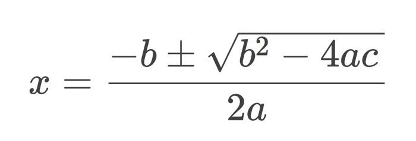

# Sum-O-Primes
## Description 
We have so much faith in RSA we give you not just the product of the primes, but their sum as well!

gen.py
output.txt

## Solve
This problem can be solved as we have the product and sum of the 2 primes. This can be achieve by using a quadratic equation.



Here we can calculate the square root value as `theta` 

```python
theta = ((bb**2) - (4*nn)).sqrt()
```

Then solve for `p` and `q`

```python
p = (bb+theta)//2
q = (bb-theta)//2
```

With `p` and `q` we can rebuild the private exponent and recover the plain text flag

```python
phi = (int(p)-1)*(int(q)-1)
d = pow(e,-1,phi)
pt = pow(int(c,16),d,n)
print( long_to_bytes(pt))
```

## Flag
`picoCTF{674b189f}`