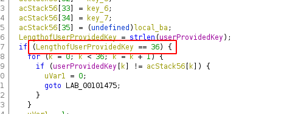
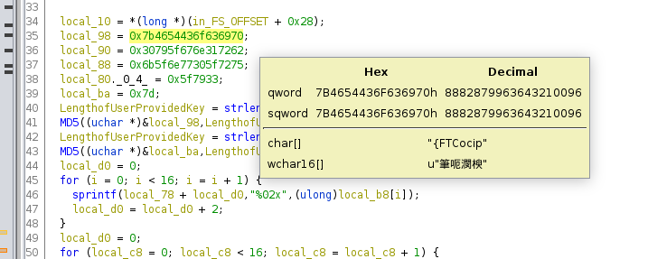
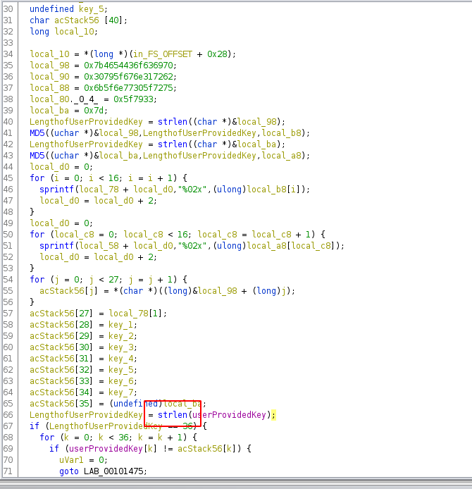
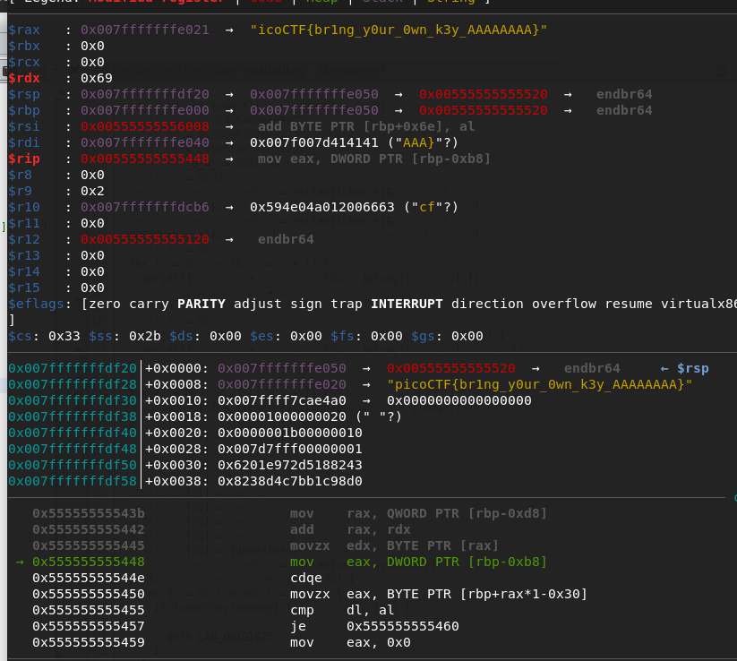
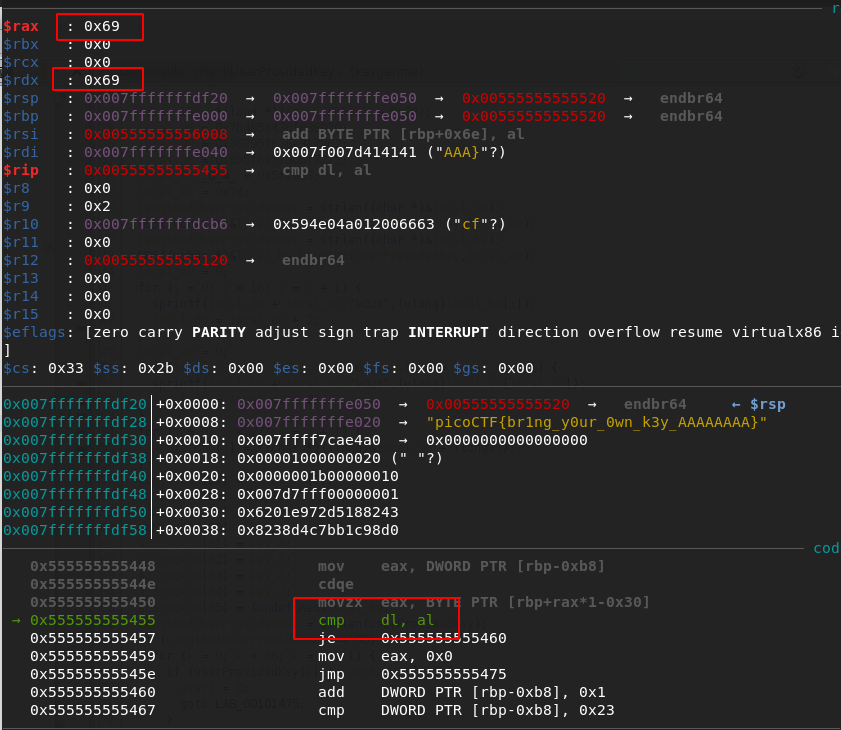
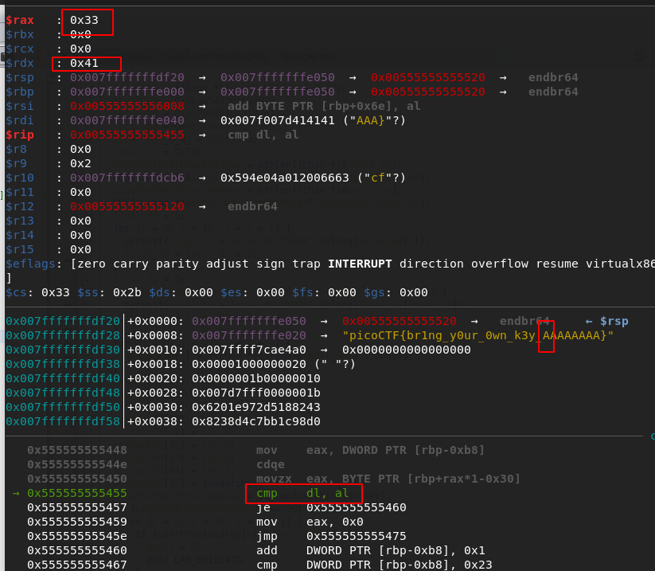
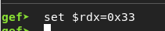

# Reversing : Keygenme

## Description 
Can you get the flag?

## Solve 
Running through the code in ghidra I was able to locate the comparison its doing with the provided user key and the expected characteristics about the key comparison.

The key is expected to be 36 chars long 



The key starts with `picoCTF{br1ng_y0ur_0wn_k3y_` and ends with `}` leaving 8 bytes to work out



We can target the strlen function to get close to our comparison by opening the binary with GDB and setting a breakpoint for `strlen`



```bash
break strlen
```

Running the application now with a dummy key filling the blank space with `AAAAAAAA` will help us to process as the hex value of `A` is `0x41`.

```
r <<<picoCTF{br1ng_y0ur_0wn_k3y_AAAAAAAA}
```

Continuing forward (`c`) until the provided key is present in a register will jump over the parts before the section we care about. 

Once the dummy key is in a register we are in the function that checks the user provided key. There will be 3 calls to this function so continuing (`c`) another 2 times will jump over the non important ones used for the MD5 calculations.

Once at the call to strlen we care about we can call step (`s`) to step over the strlen function as we dont want to go into it. From this point we are going to use only "step into" (`si`) to get the remainder of the key. 

Stepping in continually, we can see that the for loop is taking each char and moving it to register `rdx` for comparison.



Continuing to step in we see that the expected key is loaded into register `rax` before a comparison is completed.



Following this process up until out section of 8 bytes we then pause at the cmp function and see that the values of `rax` and `rdx` are different. This is because our key at `rdx` is incorrect.



We are able to change the value of `rdx` to the value expected and document the value of `rax` somewhere for later use.

```gdb
set $rdx=$rax
```



Then, stepping in again (`si`) shows that the jump condition is true as a result of `rax` and `rdx` being equal. 

This process is repeated for the remaining 7 unknown bytes until the remainder of the key is resolved. 

With the string of saved hex values we can produce the working key

```python3
key = '3362373063613165'
key = pwn.unhex(key).decode()
key = 'picoCTF{br1ng_y0ur_0wn_k3y_' + key + '}'
print(key)
```

This key can then be passed to the binary to confirm it works.

```bash
$ ./keygenme 
Enter your license key: picoCTF{br1ng_y0ur_0wn_k3y_3b70ca1e}
That key is valid.
```

## Flag
The key is the flag: `picoCTF{br1ng_y0ur_0wn_k3y_3b70ca1e}`


