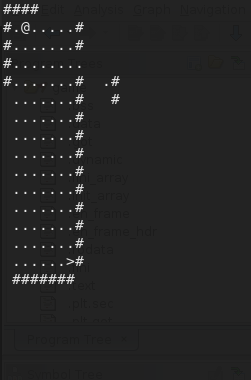

# Reverse Engineering : Wizard Like

## Description 
Do you seek your destiny in these deplorable dungeons? If so, you may want to look elsewhere. Many have gone before you and honestly, they've cleared out the place of all monsters, ne'erdowells, bandits and every other sort of evil foe. The dungeons themselves have seen better days too. There's a lot of missing floors and key passages blocked off. You'd have to be a real wizard to make any progress in this sorry excuse for a dungeon!

Download the [game](./game).

'w', 'a', 's', 'd' moves your character and 'Q' quits. You'll need to improvise some wizardly abilities to find the flag in this dungeon crawl. '.' is floor, '#' are walls, '<' are stairs up to previous level, and '>' are stairs down to next level.

## Solve

Starting off by playing the game shows that your character piece `@` can be moved within the confines of the `#` walls and on sections that have `.` for floor. This means that the character is not able to traverse blank space. 

Looking through the code there is what appears to be part of the map drawing code in a while loop with a get character condition lower down with our functions for movement and exit. 

There is no obvious wins here so next is to check out the functions list and step through each to get an understanding of their functionality. There is one function in particular that appears to be controlling the bounds of movement on the map.

We can see that the function has an if statement that is checking for a space ` ` or a wall `#`. What if we change this to return the same condition `uVar = 1` for these conditions too? Will this let us move through walls and open spaces?

First we find the byte offset in the binary, in this case its `1657`.

Next we use `elfpatch` to locate the offset we want to patch and with what data. (_This could also be completed with a hex editor_)

As the diff above shows, the binary has been patched in the expected location.

Running the patched binary we are able to now travel through walls (`#`) and over spaces (` `) that we previously could not. 

Using this new "power" and the existing level transition points (`<` and `>`) we can derive the key as it is printed as the map. 

## Flag

`picoCTF{ur_4_w1z4rd_03712109}`

